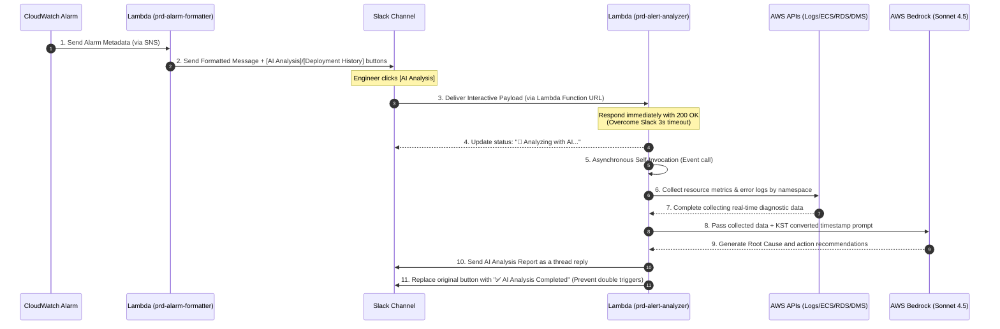

As the system scale grew, **alert fatigue** originating from various AWS resources (ALB, ECS, RDS, DMS, etc.) intensified. Every time an alert triggered, engineers consumed significant resources on repetitive troubleshooting tasks:

1. Parsing alert metadata to identify the target instance or service.
2. Logging into the CloudWatch Logs Insights console to query exception logs within the time range.
3. Auditing ECS deployment history, active database connection counts, and memory footprints to check for recent changes.

To automate this manual troubleshooting process, we designed a **Slack Incident Alert AI Analysis Tool**. By linking **`[🤖 AI Analysis]`** and **`[📋 Deployment History]`** buttons directly into CloudWatch Alarm messages, we fully automated the entire flow—from data collection to LLM inference and response generation—triggered by a single button click.

---

## 1. System Architecture and Data Flow

The E2E pipeline is divided into the **Formatter Pipeline**, which cleans up and delivers alert messages, and the asynchronous **Analysis & Diagnostic Pipeline**, which reacts to button click payloads.

### E2E Architecture Diagram


### Detailed Step-by-Step Data Flow


---

## 2. Resource-Specific Diagnostic Data Collection and Trace Paths

The AI analysis engine evaluates the **Namespace** of the alarm to dynamically collect optimal diagnostic metrics and trace log history.

| Target Service | Alarm Matching Pattern | Collected Metrics & Data | Log & Deployment Trace Path |
| :--- | :--- | :--- | :--- |
| **ELB (ALB)** | `[ELB]`, `AWS/ApplicationELB` | Target Group health status, 5XX error metrics, recent deployments | TG ARN ➡️ Target IP ➡️ Scan ECS cluster ➡️ TaskDef ➡️ logConfiguration ➡️ Trace Log Group |
| **ECS** | `[ECS]`, `AWS/ECS` | CPU/Memory utilization, active Task count, recent deployments | Service ➡️ list_tasks ➡️ TaskDef ➡️ logConfiguration (Fallback: Search prefix naming pattern) ➡️ Log Group |
| **DMS** | `[DMS]`, `AWS/DMS` | Replication latency (CDC Latency), replication task status | Task ID ➡️ describe_replication_tasks ➡️ Instance ARN ➡️ Instance ID ➡️ `dms-tasks-{id}` logs |
| **RDS** | `[RDS]`, `AWS/RDS` | CPU, Connections, Memory, IOPS, DiskQueue | Instance ID ➡️ describe_db_instances ➡️ DBClusterIdentifier ➡️ `/aws/rds/cluster/{cluster}/error` and slow query logs |
| **EC2** | `[EC2]`, `[EC2-AG]`, `AWS/EC2` | CPU, StatusCheck (Instance/System health), disk/memory utilization | Mostly metrics-driven analysis (no log collection) |
| **Lambda** | `AWS/Lambda` | Errors, Throttles, Duration | `/aws/lambda/{function_name}` error logs |

---

## 3. Core Design Decisions & Code Implementation

### ① Asynchronous Processing (Self-Invocation) to Bypass Slack's 3-Second Timeout
Slack's interactive buttons display a timeout warning if they do not receive an HTTP 200 OK response within **3 seconds** of a click. However, querying logs and performing Bedrock inference takes anywhere from 10 to 30 seconds. To solve this, `prd-alert-analyzer` invokes itself asynchronously as an Event immediately upon receipt of the payload, returning 200 OK to Slack well within the time limit.

- **Asynchronous Trigger Code (`handler.py`)**:
```python
def handle_block_action(body):
    channel = body["channel"]["id"]
    message_ts = body["message"]["ts"]
    
    # 1. Post temporary "Analyzing..." status message in Slack channel
    progress_ts = _post_progress_message(channel, message_ts)
    
    # 2. Invoke self (Lambda) asynchronously as an Event type using AWS SDK
    boto3.client("lambda").invoke(
        FunctionName=os.environ["AWS_LAMBDA_FUNCTION_NAME"],
        InvocationType="Event",
        Payload=json.dumps({
            "_async_analyze": True,
            "channel": channel,
            "message_ts": message_ts,
            "progress_ts": progress_ts,
            "user_name": body["user"]["name"],
            "alert_value": body["actions"][0]["value"],
            "original_message": body["message"]
        }).encode()
    )
    
    # 3. Return 200 OK back to Slack gateway within 3 seconds
    return response(200, "ok")
```

### ② Filtering Deployments Executed Within 30 Minutes (`data_collector.py`)
When diagnosing root causes, the most critical factor is **"recent changes (deployments)"**. However, including deployments from several days ago will cause the AI to derive incorrect correlations. To prevent this, only deployment or restart events that occurred within **30 minutes** prior to the incident are collected.
```python
def _get_ecs_deployment_info(ecs, cluster, service_name, alert_time=None):
    """Filters and returns only ECS deployments within 30 minutes of the alert"""
    deployments = get_all_deployments(ecs, cluster, service_name)
    recent = []
    
    for d in deployments:
        created_epoch = int(d["createdAt"].timestamp())
        # Pass only if the gap between the alert time and the deployment time is <= 1800 seconds (30 minutes)
        if alert_time and alert_time - created_epoch <= 1800:
            recent.append(d)
            
    if not recent:
        return "" # Exclude deployment metadata if no recent deployments exist
    return recent
```

### ③ Bedrock Claude 4.5 Prompt Engineering (`llm_analyzer.py`)
To prevent the AI from answering with superficial statements based only on error logs, the following constraints were strictly injected via the System Prompt.
- **Model ID**: `global.anthropic.claude-sonnet-4-5` (Leveraging Cross-Region Inference Profiles)
- **System Prompt Specification**:
```python
SYSTEM_PROMPT = """You are a precise cloud infrastructure failure analysis expert.
[Guidelines]
1. Keep in mind that error logs are only the 'effects' of the failure and may not be the 'root cause'.
2. Always analyze in the following order: [Infrastructure State/CPU/Metrics] -> [Network Connectivity/Dependencies] -> [Application Exception Logs].
3. Captured timestamps are in UTC. Present your analysis reports in KST (Korean Standard Time).
4. If there is a deployment event within 30 minutes of the failure, prioritize it as the most likely cause.
5. Output format:
   - Estimated Causes (Max 3)
   - Critical Logs/Metrics for Immediate Review (Max 3)
   - Recommended Remediation Steps (Max 3 steps)
   - Keep the report length compact and do not exceed the Slack message limit (1,500 characters)."""
```

---

## 4. Troubleshooting History & Solutions

1. **Lambda Function URL 403 Error**
   - **Cause**: Missing public permissions in the Lambda resource-based policy (`lambda:InvokeFunction`) to receive incoming Slack webhooks.
   - **Solution**: Added `aws_lambda_permission` in Terraform to allow unauthenticated invocations originating from Slack domains.
2. **Bedrock ValidationException (apac prefix error)**
   - **Cause**: Regional incompatibility constraints occurred when calling AWS Bedrock Asia-Pacific inference profiles (`apac.anthropic...`).
   - **Solution**: Bound the model ID to the cross-region identifier `global.anthropic.claude-sonnet-4-5` to enable automated region delegation.
3. **Bedrock AccessDenied (Cross-Region Permission)**
   - **Cause**: The IAM role permission for Bedrock execution was restricted too tightly to the local region, causing delegation to other regional inference profiles to be denied.
   - **Solution**: Explicitly added the cross-region foundation-model ARN to the `Resource` clause of the IAM Policy.
4. **Redis Error Logs Not Detected**
   - **Cause**: Simple keyword matching in the `@message` field missed Elasticsearch and Redis standard format alarms.
   - **Solution**: Improved log parser query statements to filter accurately by `level = 'ERROR'`.
5. **ELB Target Group Health 403 Error**
   - **Cause**: Access denied because IAM policies do not support resource-level permissions for describing certain ELB ARN details.
   - **Solution**: Expanded the `Resource` clause of the ELB description API permissions to wildcards (`*`).
6. **AI Timezone Confusion (UTC vs KST)**
   - **Cause**: CloudWatch logs are logged in UTC, whereas deployment events were tracked in KST. The AI rejected the correlation because of the 9-hour offset difference.
   - **Solution**: Structured the Lambda collector to convert all log timestamps and metrics queries into Korean Standard Time (KST, UTC+9) before feeding them into the LLM context.

---

## 5. Operational Cost Analysis (Cost Optimization)

By building a 100% serverless, on-demand infrastructure with no always-on servers, operating costs were dramatically minimized:
- **Lambda Cost**: Approx 30-50s run duration with 256MB memory allocation ➡️ **~$0.0002 / run**
- **AWS Bedrock Cost**: Claude 4.5 using 2,000 input tokens + 1,200 output tokens ➡️ **~$0.01 / run**
- **Total Estimated Cost**: Running 10 analyses a day sums to a **monthly total of around $3 to $4 (less than 5,000 KRW)**. (This represents a **95%+ cost reduction** compared to hosting web applications on always-on EC2 instances.)

---

## 6. Future Roadmap & Improvement Directions

1. **Two-Way Threaded Interactions**: Allow engineers to prompt the bot inside Slack threads (e.g., `@Alarmbot Analyze CPU metrics within this timeframe too`) for real-time interactive diagnostics.
2. **Datadog APM Trace Integration**: Integrate trace links to inspect microservice bottleneck propagation.
3. **Runbook Integration**: Extend the report to automatically query and hyperlink internal wikis (Confluence) for specific runbooks matching the estimated causes.
