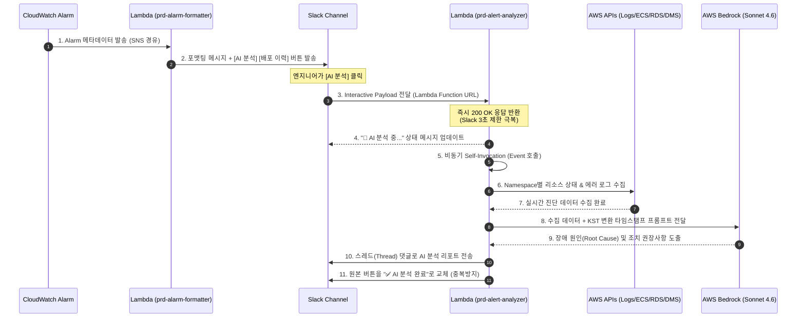

시스템 규모가 커짐에 따라 다양한 AWS 리소스(ALB, ECS, RDS, DMS 등)에서 발생하는 **경보 피로감(Alert Fatigue)**이 심화되었습니다. 알림이 발생할 때마다 엔지니어는 다음과 같은 반복 작업에 리소스를 소모했습니다:

1. 경보 메타데이터를 파싱하여 대상 인스턴스/서비스 식별
2. CloudWatch Logs Insights 콘솔에 접속하여 해당 시간대의 예외(Exception) 로그 검색
3. ECS 배포 이력이나 DB 연결 수(Database Connections), 메모리 점유율을 대조하여 최근 변경 사항이 있는지 대조

이러한 수동 트러블슈팅 프로세스를 자동화하기 위해 **Slack 장애 알림 AI 분석 도구**를 기획했습니다. CloudWatch Alarm 메시지에 **`[🤖 AI 분석]`** 및 **`[📋 배포 이력]`** 버튼을 연동하여, 버튼 클릭 시 관련 데이터 수집부터 LLM 추론을 통한 조치 방안 제공까지의 전 과정을 완전 자동화했습니다.

---

## 1. 시스템 아키텍처 및 데이터 흐름

E2E 파이프라인은 크게 경보를 정돈하여 발송하는 **포맷터 파이프라인**과 클릭 액션에 반응하는 비동기 **분석 진단 파이프라인**으로 나뉩니다.

### E2E 아키텍처 다이어그램


### 상세 단계별 데이터 이동 흐름


---

## 2. 서비스별 진단 데이터 수집 및 로그 역추적 구현

AI 분석 엔진은 알람의 **Namespace**를 분석하여 최적의 진단 데이터를 동적으로 수집하고 로그를 역추적합니다.

| 대상 서비스 | 알람 식별 패턴 | 수집 메트릭 및 데이터 | 로그 및 배포 이력 추적 경로 |
| :--- | :--- | :--- | :--- |
| **ELB (ALB)** | `[ELB]`, `AWS/ApplicationELB` | Target Group 헬스체크 상태, 5XX 에러 메트릭, 최근 배포 이력 | TG ARN ➡️ Target IP ➡️ ECS 클러스터 순회 ➡️ TaskDef ➡️ logConfiguration ➡️ 로그 그룹 추적 |
| **ECS** | `[ECS]`, `AWS/ECS` | CPU/Memory 사용률, 서비스 Task 개수 상태, 최근 배포 이력 | Service ➡️ list_tasks ➡️ TaskDef ➡️ logConfiguration (실패 시 네이밍 패턴 prefix 검색) ➡️ 로그 그룹 |
| **DMS** | `[DMS]`, `AWS/DMS` | CDC Latency(복제 지연), 복제 태스크 상태 | Task ID ➡️ describe_replication_tasks ➡️ Instance ARN ➡️ Instance ID ➡️ `dms-tasks-{id}` 로그 |
| **RDS** | `[RDS]`, `AWS/RDS` | CPU, Connection Count, Memory, IOPS, DiskQueue | Instance ID ➡️ describe_db_instances ➡️ DBClusterIdentifier ➡️ `/aws/rds/cluster/{cluster}/error` 및 slowquery 로그 |
| **EC2** | `[EC2]`, `[EC2-AG]`, `AWS/EC2` | CPU, StatusCheck(인스턴스/시스템 헬스), 디스크 및 메모리 사용량 | 메트릭 기반 분석 위주 (로그 수집 안 함) |
| **Lambda** | `AWS/Lambda` | Errors, Throttles, Duration | `/aws/lambda/{function_name}` 에러 로그 조회 |

---

## 3. 핵심 설계 결정사항 & 코드 구현

### ① 슬랙 3초 타임아웃 제한 회피를 위한 비비동기 처리 (Self-Invocation)
슬랙의 대화형(Interactive) 버튼은 사용자가 버튼을 누른 후 **3초 이내**에 HTTP 200 OK 응답을 받지 못하면 타임아웃 경고를 출력합니다. 하지만 로그를 수집하고 Bedrock을 통해 추론을 완료하는 데는 최소 10초에서 최대 30초가 소요됩니다.
이를 해결하기 위해 `prd-alert-analyzer`는 클릭 수신 직후 3초 이내에 **비동기 자기 자신 호출(Self-Invocation)** 구조를 적용했습니다.

- **비동기 트리거 코드 (`handler.py`)**:
```python
def handle_block_action(body):
    channel = body["channel"]["id"]
    message_ts = body["message"]["ts"]
    
    # 1. 슬랙 채널에 "분석 중..." 임시 상태 메시지 게시
    progress_ts = _post_progress_message(channel, message_ts)
    
    # 2. AWS SDK를 사용하여 자기 자신(Lambda)을 Event(비동기) 타입으로 호출
    boto3.client("lambda").invoke(
        FunctionName=os.environ["AWS_LAMBDA_FUNCTION_NAME"],
        InvocationType="Event",
        Payload=json.dumps({
            "_async_analyze": True,
            "channel": channel,
            "message_ts": message_ts,
            "progress_ts": progress_ts,
            "user_name": body["user"]["name"],
            "alert_value": body["actions"][0]["value"],
            "original_message": body["message"]
        }).encode()
    )
    
    # 3. 슬랙 게이트웨이로 3초 이내에 200 OK 반환 완료
    return response(200, "ok")
```

### ② 배포 이력 30분 이내 필터링 (`data_collector.py`)
장애 원인을 분석할 때 가장 중요한 것은 **\"최근 변경점(Deployment)\"**입니다. 그러나 며칠 전에 배포된 로그까지 분석 대상에 포함하면 AI가 엉뚱한 결정을 내리게 됩니다. 이를 방지하기 위해 장애 발생 직전 **30분 이내**에 발생한 배포/재시작 이벤트만 추출하여 분석 정보에 동봉합니다.
```python
def _get_ecs_deployment_info(ecs, cluster, service_name, alert_time=None):
    """장애 발생 시점 30분 이내의 ECS 배포만 필터링하여 리턴"""
    deployments = get_all_deployments(ecs, cluster, service_name)
    recent = []
    
    for d in deployments:
        created_epoch = int(d["createdAt"].timestamp())
        # 장애 시점과 배포 시점 격차가 1800초(30분) 이하인 경우에만 통과
        if alert_time and alert_time - created_epoch <= 1800:
            recent.append(d)
            
    if not recent:
        return "" # 최근 배포가 없으면 분석에서 배포 메타데이터 제외
    return recent
```

### ③ Bedrock Claude 3.5 Sonnet 프롬프팅 철학 (`llm_analyzer.py`)
AI가 피상적인 로그 메시지만 보고 답하는 것을 방지하기 위해 다음과 같은 규칙을 시스템 프롬프트(System Prompt)로 엄격히 주입하였습니다.
- **모델 ID**: `global.anthropic.claude-sonnet-4-6` (Cross-Region Inference Profile 활용)
- **시스템 프롬프트 명세**:
```python
SYSTEM_PROMPT = """당신은 정밀한 클라우드 인프라 장애 분석 전문가입니다.
[지침]
1. 에러 로그는 '장애의 결과'일 뿐이며, '근본 원인'이 아닐 수 있음을 인지하세요.
2. 분석 순서는 항상 [인프라 상태/CPU/메트릭] -> [네트워크 연결/의존성] -> [애플리케이션 예외로그] 순서로 다면 분석을 수행합니다.
3. 수집된 타임스탬프는 UTC 기준이므로 전달된 KST 변환 시간을 기준으로 분석을 보고하세요.
4. 장애 발생 30분 이내에 발생한 배포 이력이 존재할 경우, 코드 수정 또는 신규 배포 버그일 가능성을 최우선순위로 검토하세요.
5. 출력 포맷:
   - 추정 원인 (최대 3개)
   - 즉시 확인이 필요한 핵심 로그/지표 (최대 3개)
   - 조치 권장 단계 (최대 3단계)
   - 분석 리포트의 전체 길이는 슬랙 전송 제약(1,500자)을 초과하지 않도록 컴팩트하게 구성하세요."""
```

---

## 4. 트러블슈팅 이력 및 해결 방법 (Troubleshooting)

1. **Lambda Function URL 403 에러**
   - **원인**: 외부 슬랙 웹훅 요청을 수신해야 하나, 람다의 리소스 기반 정책(`lambda:InvokeFunction`)에 퍼블릭 허용 권한이 누락됨.
   - **해결**: Terraform 코드에 `aws_lambda_permission` 리소스를 추가하여 무인증 및 슬랙 도메인 인증 호출이 가능하도록 정책 바인딩 적용.
2. **Bedrock ValidationException (apac prefix 에러)**
   - **원인**: AWS Bedrock 아시아 퍼시픽 리전 추론 프로필(`apac.anthropic...`) 호출 시 호환되지 않는 리전 제약 발생.
   - **해결**: 크로스 리전 모델 ID인 `global.anthropic.claude-sonnet-4-6`로 고정하여 가용 영역 간의 자동 모델 가동을 구현.
3. **Bedrock AccessDenied (Cross-Region Permission)**
   - **원인**: IAM Role에 Bedrock 실행 권한을 줄 때 리소스 제한을 타이트하게 주어 타 리전 추론 프로필로의 위임 권한이 거부됨.
   - **해결**: IAM Policy의 `Resource` 절에 foundation-model ARN을 명시적으로 추가하여 권한 획득 성공.
4. **Redis 에러 로그 미검출 현상**
   - **원인**: CloudWatch Logs 필터링 시 `@message` 필드에서 단순 예외 키워드만 찾다 보니 엘라스티캐시 및 Redis의 표준 포맷 경보 누락.
   - **해결**: 쿼리 구문을 `level = 'ERROR'` 기반으로 정밀 필터링하도록 로그 파서 코드 개선.
5. **ELB Target Group Health 403 에러**
   - **원인**: target-group 리소스 레벨 IAM 정책에서 AWS가 특정 ARN 조회를 전적으로 지원하지 않아 접근 제어 거부 발생.
   - **해결**: ELB 진단 관련 describe API의 Resource 지정을 와일드카드(`*`)로 넓혀 권한 인가 처리.
6. **AI 시간대 혼동 (UTC vs KST)**
   - **원인**: AWS CloudWatch 로그는 기본적으로 UTC 시간대로 적혀있어, 한국 시간 기준 배포 이력과 대조 시 AI가 시간차가 심하다며 배포의 연관성을 부정함.
   - **해결**: 데이터 수집 람다 핸들러 단에서 모든 로그 시간 및 메트릭 수집 범위를 한국 시간대(KST, UTC+9)로 오프셋 포맷팅하여 LLM 컨텍스트에 전달함.

---

## 5. 운영 비용 분석 (Cost Optimization)

본 분석 봇은 상시 가동 서버가 없는 100% 서버리스 온디맨드 과금으로 설계되어 비용을 대폭 아꼈습니다.
- **Lambda 비용**: 1회 분석 시 약 30~50초 실행, 메모리 256MB 할당 기준 ➡️ 약 **$0.0002 / 회**
- **AWS Bedrock 비용**: Claude 3.5 Sonnet 입력 2,000 토큰 + 출력 1,200 토큰 기준 ➡️ 약 **$0.01 / 회**
- **종합 예상 운영 비용**: 하루 평균 10회 장애 분석이 실행된다고 가정했을 때, **월 총합 약 $3 ~ $4 (약 5,000원 이하)** 수준으로 유지 가능합니다. (상시 가동하여 웹 애플리케이션을 띄워두는 기존 EC2 운영 대비 비용을 **95% 이상** 절감)

---

## 6. 향후 로드맵 및 개선 방향

1. **양방향 멘션 대화**: 스레드 댓글 하단에 `@Alarmbot`을 호출하여 "이 시간대 CPU 점유율도 같이 분석해줘" 와 같은 실시간 질의응답 및 추가 분석 지원.
2. **Datadog APM Trace 연동**: 단순 AWS API 조회를 넘어, Datadog 호출 체인을 기반으로 한 마이크로서비스간의 병목 지점 추적.
3. **Runbook 자동 연결**: AI가 원인을 도출한 뒤 사내 위키(Confluence)의 조치 가이드를 자동 링크로 가져오도록 확장.
